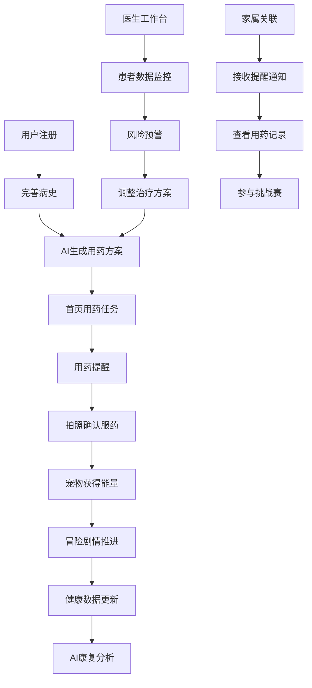

# MediQuest（智药探险）产品需求文档

## 1. 产品概述

MediQuest是一款将AI智能用药指导与游戏化用药体验相结合的医疗健康应用，通过AI提供个性化用药建议与监督，用小游戏提升用药依从性，并全程追踪用户的用药与康复轨迹。

面向多病共治患者、耐药风险患者、空巢老人及其家属，以及医生群体，实现科学用药 + 有趣体验 + 持续康复的目标。

产品口号：让用药变成一场有趣的冒险。

## 2. 核心功能

### 2.1 用户角色

| 角色   | 注册方式          | 核心权限              |
| ---- | ------------- | ----------------- |
| 患者用户 | 手机号/邮箱注册，实名认证 | 用药管理、游戏体验、健康数据查看  |
| 家属用户 | 邀请码注册，关联患者    | 查看关联患者用药记录、接收提醒通知 |
| 医生用户 | 医师执业证书认证      | 患者管理、用药方案制定、数据分析  |
| 药师用户 | 药师执业证书认证      | 用药咨询、药物冲突检测、用药指导  |

### 2.2 功能模块

我们的MediQuest应用包含以下主要页面：

1. **首页**：今日用药任务列表、宠物状态展示、健康进度条、快捷功能入口
2. **用药管理页**：用药时间表、药物详情、AI用药顾问、拍照识别确认
3. **游戏中心页**：宠物养成界面、冒险地图、挑战赛、成就系统
4. **健康数据页**：用药依从性统计、康复趋势图、AI康复报告
5. **医生工作台**：患者列表、数据面板、风险预警、治疗方案管理
6. **个人中心页**：用户信息、设置选项、家属关联、老人模式切换

### 2.3 页面详情

| 页面名称  | 模块名称   | 功能描述                      |
| ----- | ------ | ------------------------- |
| 首页    | 用药任务列表 | 显示今日待服药物，颜色图标区分时间段，语音提醒功能 |
| 首页    | 宠物状态展示 | 实时显示宠物健康状态、等级、能量值，互动动画效果  |
| 首页    | 健康进度条  | 可视化展示用药依从性、康复进度、健康指标趋势    |
| 用药管理页 | AI用药顾问 | 分析病史生成个性化方案，检测药物冲突，解释药物作用 |
| 用药管理页 | 用药时间表  | 智能排程用药时间，餐前餐后提醒，大字号老人友好显示 |
| 用药管理页 | 拍照识别确认 | 扫码或拍照识别药物，确认服用记录，漏服误服预警   |
| 游戏中心页 | 宠物养成系统 | 按时服药获得能量，宠物成长升级，漏服导致生病机制  |
| 游戏中心页 | 剧情冒险模式 | 药物角色化推动剧情，LLM生成个性化故事内容    |
| 游戏中心页 | 康复挑战赛  | 家人朋友组队打卡，积分排行榜，成就勋章系统     |
| 健康数据页 | 依从性统计  | 记录服药打卡情况，生成依从性报告和趋势分析     |
| 健康数据页 | 康复趋势图  | 可视化健康指标变化，体重血压血糖等数据图表     |
| 健康数据页 | AI康复报告 | 周期性生成康复总结，提供下阶段治疗建议       |
| 医生工作台 | 患者管理列表 | 按风险等级排序患者，快速查看关键信息和状态     |
| 医生工作台 | 数据分析面板 | 依从性曲线分析，药物冲突预警，康复趋势监控     |
| 医生工作台 | 治疗方案管理 | AI辅助优化治疗方案，远程调整用药计划       |
| 个人中心页 | 用户信息管理 | 个人资料编辑，病史记录，家属关联设置        |
| 个人中心页 | 系统设置   | 提醒设置，老人模式切换，隐私安全配置        |

## 3. 核心流程

**患者用药流程：**
用户注册登录 → 完善病史信息 → AI生成用药方案 → 设置提醒时间 → 接收用药提醒 → 拍照确认服药 → 宠物获得能量 → 推进冒险剧情 → 查看康复数据

**医生管理流程：**
医生认证登录 → 查看患者列表 → 分析用药数据 → 接收风险预警 → 调整治疗方案 → 远程指导患者 → 生成康复报告

**家属关怀流程：**
家属注册关联 → 接收患者用药提醒 → 查看服药记录 → 参与挑战赛 → 鼓励坚持用药

## 4. 用户界面设计

### 4.1 设计风格

* **主色调**：医疗蓝#2E86AB、科技紫#A23B72，辅助色橙色#F18F01、健康绿#C73E1D

* **按钮样式**：圆角矩形按钮，渐变色彩，微阴影效果

* **字体设计**：思源黑体，标题18-24px，正文14-16px，老人模式20-28px

* **布局风格**：卡片式设计，顶部导航，底部Tab栏，网格化排列

* **图标风格**：线性图标配合彩色填充，医疗主题图标库，宠物卡通形象

### 4.2 页面设计概览

| 页面名称  | 模块名称   | UI元素                              |
| ----- | ------ | --------------------------------- |
| 首页    | 用药任务列表 | 卡片式布局，药物图标+名称+时间，颜色编码区分紧急程度，大按钮设计 |
| 首页    | 宠物展示区  | 3D卡通宠物形象，动态表情，能量条显示，互动点击效果        |
| 游戏中心页 | 宠物养成界面 | 温馨家园场景，宠物状态面板，升级进度条，技能树展示         |
| 游戏中心页 | 冒险地图   | 手绘风格地图，关卡节点，进度路径，解锁动画效果           |
| 用药管理页 | AI顾问对话 | 聊天气泡界面，智能回复建议，语音播报按钮，收藏功能         |
| 健康数据页 | 趋势图表   | 折线图展示康复趋势，饼图显示依从性比例，颜色渐变效果        |
| 医生工作台 | 数据面板   | 仪表盘式布局，关键指标卡片，预警红色标识，快捷操作按钮       |

### 4.3 响应式设计

产品采用移动端优先设计，支持手机、平板多尺寸适配。老人模式提供大字体、高对比度、语音播报等无障碍功能。游戏界面针对触屏操作优化，支持手势交互和震动反馈。
