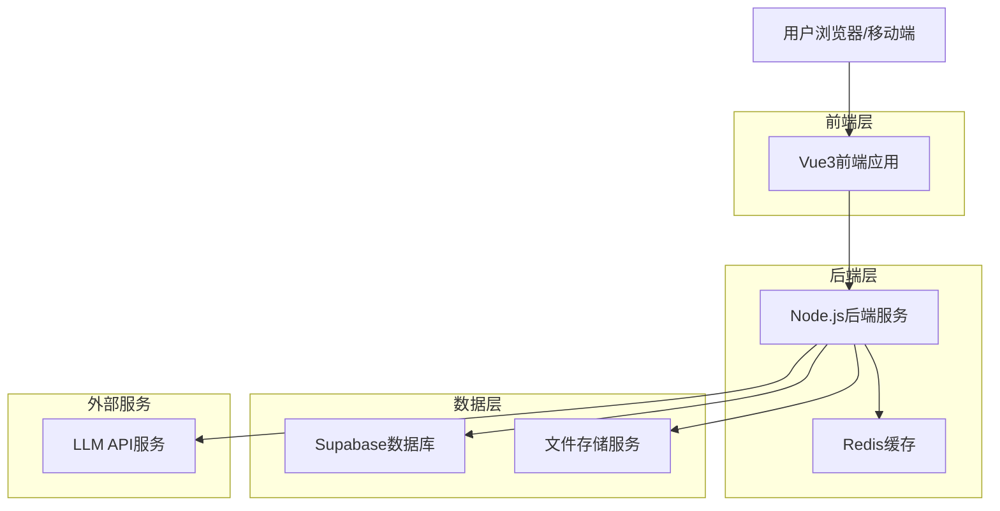
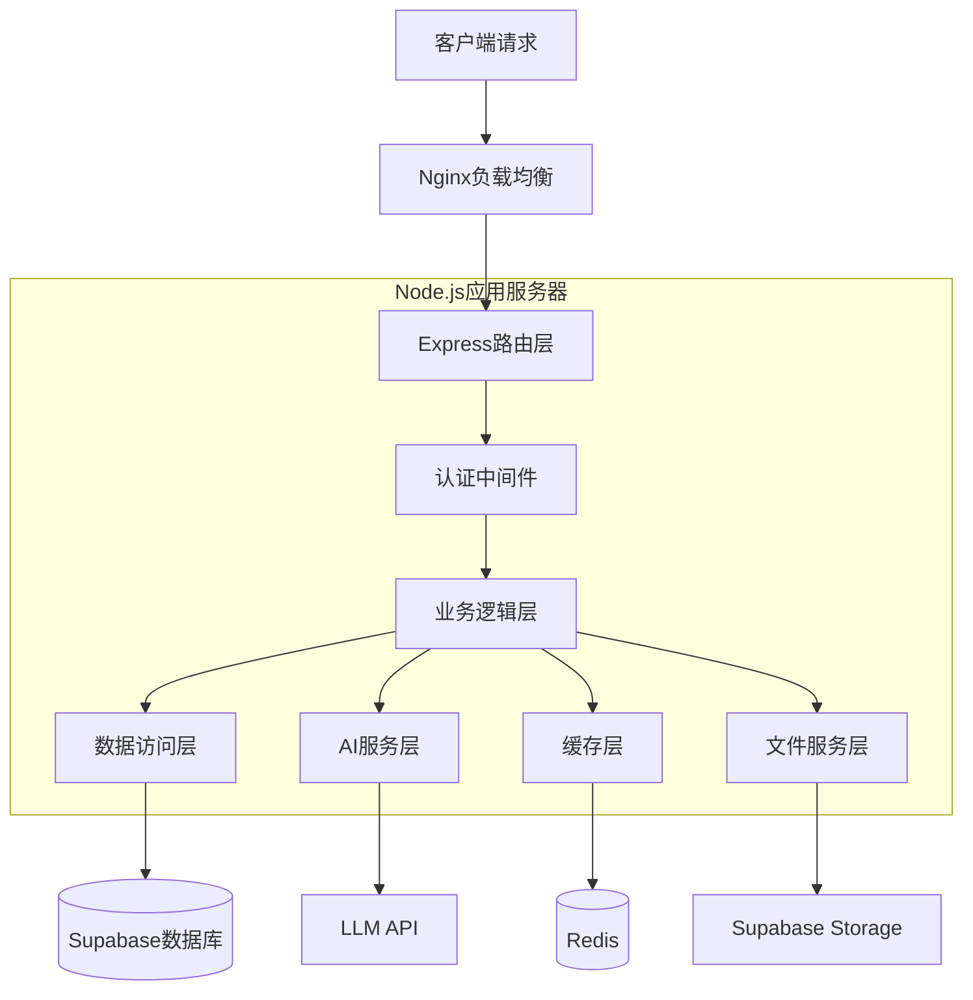
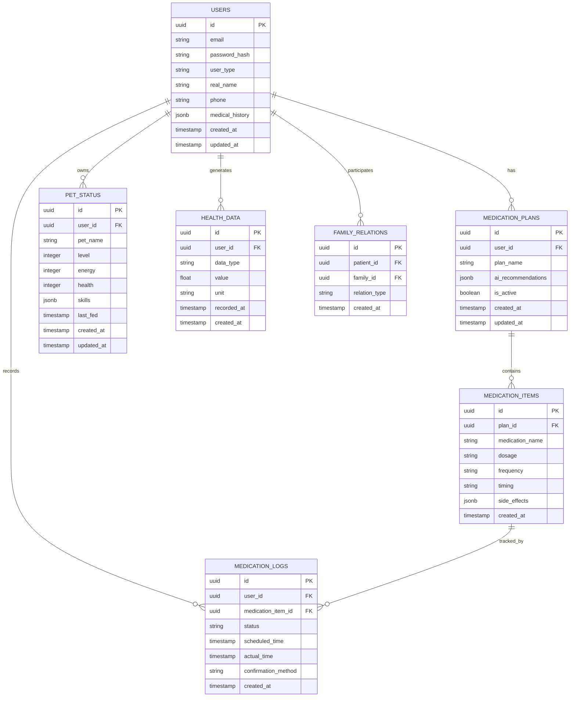

# MediQuest（智药探险）技术架构文档

## 1. 架构设计



## 2. 技术描述

* **前端**: Vue3\@3.3 + TypeScript + Vite + Element Plus + Tailwind CSS

* **后端**: Node.js\@18 + Express\@4 + TypeScript

* **数据库**: Supabase (PostgreSQL)

* **缓存**: Redis\@7

* **AI服务**: OpenAI GPT-4 / 百度文心一言

* **文件存储**: Supabase Storage

* **实时通信**: Socket.io

* **移动端**: PWA + Capacitor

## 3. 路由定义

| 路由                | 用途                |
| ----------------- | ----------------- |
| /                 | 首页，显示今日用药任务和宠物状态  |
| /login            | 登录页面，支持患者/医生/家属登录 |
| /register         | 注册页面，包含角色选择和认证流程  |
| /medication       | 用药管理页面，AI顾问和用药时间表 |
| /game             | 游戏中心，宠物养成和冒险模式    |
| /health-data      | 健康数据页面，统计图表和康复报告  |
| /doctor-dashboard | 医生工作台，患者管理和数据分析   |
| /profile          | 个人中心，用户信息和系统设置    |
| /family           | 家属关联页面，查看关联患者信息   |

## 4. API定义

### 4.1 用户认证相关

**用户注册**

```
POST /api/auth/register
```

请求参数:

| 参数名           | 参数类型   | 是否必需  | 描述                         |
| ------------- | ------ | ----- | -------------------------- |
| email         | string | true  | 用户邮箱                       |
| password      | string | true  | 密码                         |
| userType      | string | true  | 用户类型：patient/doctor/family |
| realName      | string | true  | 真实姓名                       |
| phone         | string | true  | 手机号码                       |
| certification | object | false | 医生/药师认证信息                  |

响应:

| 参数名     | 参数类型    | 描述     |
| ------- | ------- | ------ |
| success | boolean | 注册是否成功 |
| userId  | string  | 用户ID   |
| token   | string  | 访问令牌   |

### 4.2 用药管理相关

**获取用药方案**

```
GET /api/medication/plan/{userId}
```

**AI用药咨询**

```
POST /api/ai/medication-advice
```

请求参数:

| 参数名               | 参数类型   | 是否必需  | 描述   |
| ----------------- | ------ | ----- | ---- |
| userId            | string | true  | 用户ID |
| question          | string | true  | 咨询问题 |
| medicationHistory | array  | false | 用药历史 |
| symptoms          | array  | false | 症状描述 |

**药物识别**

```
POST /api/medication/recognize
```

请求参数:

| 参数名    | 参数类型   | 是否必需 | 描述   |
| ------ | ------ | ---- | ---- |
| image  | file   | true | 药物图片 |
| userId | string | true | 用户ID |

### 4.3 游戏系统相关

**获取宠物状态**

```
GET /api/game/pet/{userId}
```

**更新宠物状态**

```
PUT /api/game/pet/{userId}
```

**生成冒险剧情**

```
POST /api/ai/adventure-story
```

### 4.4 健康数据相关

**记录用药打卡**

```
POST /api/health/medication-log
```

**获取康复报告**

```
GET /api/health/recovery-report/{userId}
```

## 5. 服务器架构图



## 6. 数据模型

### 6.1 数据模型定义



### 6.2 数据定义语言

**用户表 (users)**

```sql
-- 创建用户表
CREATE TABLE users (
    id UUID PRIMARY KEY DEFAULT gen_random_uuid(),
    email VARCHAR(255) UNIQUE NOT NULL,
    password_hash VARCHAR(255) NOT NULL,
    user_type VARCHAR(20) NOT NULL CHECK (user_type IN ('patient', 'doctor', 'family', 'pharmacist')),
    real_name VARCHAR(100) NOT NULL,
    phone VARCHAR(20) NOT NULL,
    medical_history JSONB DEFAULT '{}',
    certification JSONB DEFAULT '{}',
    is_verified BOOLEAN DEFAULT false,
    created_at TIMESTAMP WITH TIME ZONE DEFAULT NOW(),
    updated_at TIMESTAMP WITH TIME ZONE DEFAULT NOW()
);

-- 创建索引
CREATE INDEX idx_users_email ON users(email);
CREATE INDEX idx_users_user_type ON users(user_type);
CREATE INDEX idx_users_phone ON users(phone);
```

**用药方案表 (medication\_plans)**

```sql
-- 创建用药方案表
CREATE TABLE medication_plans (
    id UUID PRIMARY KEY DEFAULT gen_random_uuid(),
    user_id UUID NOT NULL REFERENCES users(id) ON DELETE CASCADE,
    plan_name VARCHAR(200) NOT NULL,
    ai_recommendations JSONB DEFAULT '{}',
    is_active BOOLEAN DEFAULT true,
    created_by UUID REFERENCES users(id),
    created_at TIMESTAMP WITH TIME ZONE DEFAULT NOW(),
    updated_at TIMESTAMP WITH TIME ZONE DEFAULT NOW()
);

-- 创建索引
CREATE INDEX idx_medication_plans_user_id ON medication_plans(user_id);
CREATE INDEX idx_medication_plans_is_active ON medication_plans(is_active);
```

**用药项目表 (medication\_items)**

```sql
-- 创建用药项目表
CREATE TABLE medication_items (
    id UUID PRIMARY KEY DEFAULT gen_random_uuid(),
    plan_id UUID NOT NULL REFERENCES medication_plans(id) ON DELETE CASCADE,
    medication_name VARCHAR(200) NOT NULL,
    dosage VARCHAR(100) NOT NULL,
    frequency VARCHAR(100) NOT NULL,
    timing VARCHAR(100) NOT NULL,
    side_effects JSONB DEFAULT '[]',
    drug_interactions JSONB DEFAULT '[]',
    created_at TIMESTAMP WITH TIME ZONE DEFAULT NOW()
);

-- 创建索引
CREATE INDEX idx_medication_items_plan_id ON medication_items(plan_id);
```

**用药记录表 (medication\_logs)**

```sql
-- 创建用药记录表
CREATE TABLE medication_logs (
    id UUID PRIMARY KEY DEFAULT gen_random_uuid(),
    user_id UUID NOT NULL REFERENCES users(id) ON DELETE CASCADE,
    medication_item_id UUID NOT NULL REFERENCES medication_items(id) ON DELETE CASCADE,
    status VARCHAR(20) NOT NULL CHECK (status IN ('taken', 'missed', 'delayed', 'skipped')),
    scheduled_time TIMESTAMP WITH TIME ZONE NOT NULL,
    actual_time TIMESTAMP WITH TIME ZONE,
    confirmation_method VARCHAR(50) CHECK (confirmation_method IN ('photo', 'qr_code', 'manual')),
    notes TEXT,
    created_at TIMESTAMP WITH TIME ZONE DEFAULT NOW()
);

-- 创建索引
CREATE INDEX idx_medication_logs_user_id ON medication_logs(user_id);
CREATE INDEX idx_medication_logs_scheduled_time ON medication_logs(scheduled_time DESC);
CREATE INDEX idx_medication_logs_status ON medication_logs(status);
```

**宠物状态表 (pet\_status)**

```sql
-- 创建宠物状态表
CREATE TABLE pet_status (
    id UUID PRIMARY KEY DEFAULT gen_random_uuid(),
    user_id UUID NOT NULL REFERENCES users(id) ON DELETE CASCADE,
    pet_name VARCHAR(100) DEFAULT '小药丸',
    level INTEGER DEFAULT 1,
    energy INTEGER DEFAULT 100,
    health INTEGER DEFAULT 100,
    experience INTEGER DEFAULT 0,
    skills JSONB DEFAULT '[]',
    last_fed TIMESTAMP WITH TIME ZONE DEFAULT NOW(),
    created_at TIMESTAMP WITH TIME ZONE DEFAULT NOW(),
    updated_at TIMESTAMP WITH TIME ZONE DEFAULT NOW()
);

-- 创建索引
CREATE INDEX idx_pet_status_user_id ON pet_status(user_id);
```

**健康数据表 (health\_data)**

```sql
-- 创建健康数据表
CREATE TABLE health_data (
    id UUID PRIMARY KEY DEFAULT gen_random_uuid(),
    user_id UUID NOT NULL REFERENCES users(id) ON DELETE CASCADE,
    data_type VARCHAR(50) NOT NULL,
    value DECIMAL(10,2) NOT NULL,
    unit VARCHAR(20),
    recorded_at TIMESTAMP WITH TIME ZONE NOT NULL,
    created_at TIMESTAMP WITH TIME ZONE DEFAULT NOW()
);

-- 创建索引
CREATE INDEX idx_health_data_user_id ON health_data(user_id);
CREATE INDEX idx_health_data_type ON health_data(data_type);
CREATE INDEX idx_health_data_recorded_at ON health_data(recorded_at DESC);
```

**家属关系表 (family\_relations)**

```sql
-- 创建家属关系表
CREATE TABLE family_relations (
    id UUID PRIMARY KEY DEFAULT gen_random_uuid(),
    patient_id UUID NOT NULL REFERENCES users(id) ON DELETE CASCADE,
    family_id UUID NOT NULL REFERENCES users(id) ON DELETE CASCADE,
    relation_type VARCHAR(50) NOT NULL,
    is_primary_contact BOOLEAN DEFAULT false,
    created_at TIMESTAMP WITH TIME ZONE DEFAULT NOW()
);

-- 创建索引
CREATE INDEX idx_family_relations_patient_id ON family_relations(patient_id);
CREATE INDEX idx_family_relations_family_id ON family_relations(family_id);

-- 创建唯一约束
ALTER TABLE family_relations ADD CONSTRAINT unique_family_relation 
    UNIQUE (patient_id, family_id);
```

**权限设置**

```sql
-- 为anon角色授予基本读取权限
GRANT SELECT ON users TO anon;
GRANT SELECT ON medication_plans TO anon;
GRANT SELECT ON medication_items TO anon;

-- 为authenticated角色授予完整权限
GRANT ALL PRIVILEGES ON users TO authenticated;
GRANT ALL PRIVILEGES ON medication_plans TO authenticated;
GRANT ALL PRIVILEGES ON medication_items TO authenticated;
GRANT ALL PRIVILEGES ON medication_logs TO authenticated;
GRANT ALL PRIVILEGES ON pet_status TO authenticated;
GRANT ALL PRIVILEGES ON health_data TO authenticated;
GRANT ALL PRIVILEGES ON family_relations TO authenticated;
```

**初始化数据**

```sql
-- 插入示例医生用户
INSERT INTO users (email, password_hash, user_type, real_name, phone, is_verified, certification)
VALUES 
('doctor@mediquest.com', '$2b$10$example_hash', 'doctor', '张医生', '13800138000', true, 
 '{"license_number": "110101199001011234", "hospital": "北京协和医院", "department": "内科"}'),
('pharmacist@mediquest.com', '$2b$10$example_hash', 'pharmacist', '李药师', '13800138001', true,
 '{"license_number": "110101199001011235", "pharmacy": "同仁堂药店", "certification_level": "主管药师"}');

-- 插入示例患者用户
INSERT INTO users (email, password_hash, user_type, real_name, phone, medical_history)
VALUES 
('patient@mediquest.com', '$2b$10$example_hash', 'patient', '王患者', '13800138002', 
 '{"conditions": ["高血压", "糖尿病"], "allergies": ["青霉素"], "age": 65}');
```

